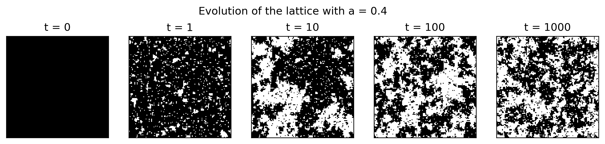
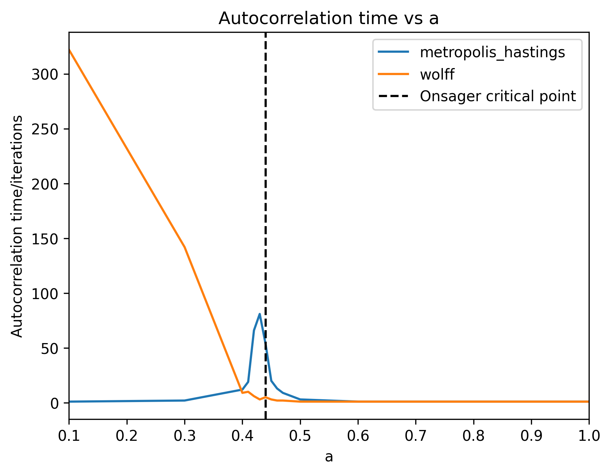

# Cluster Algorithms for Monte Carlo Simulation

Python implementations of Markov chain Monte Carlo (MCMC) methods for two
classic statistical-physics models: the 2D Ising model and a hard-disk
fluid, comparing the standard **Metropolis-Hastings** algorithm against a **cluster algorithm** for each
model. The project measures how each algorithm's autocorrelation time and
runtime scale with system size, to quantify when cluster updates pay off.

The project write-up with theory and derivations, implementation details, and a
discussion of all results is in [`Report/report.pdf`](Report/report.pdf).

## Models and algorithms

| Model | Directory | [Metropolis-Hastings](https://doi.org/10.1063/1.1699114) | Cluster algorithm |
|---|---|---|---|
| 2D Ising model (spins on a periodic lattice) | [`Ising/`](Ising) | single-spin-flip, vectorized over a checkerboard decomposition | [Wolff algorithm](https://doi.org/10.1103/PhysRevLett.62.361) |
| Hard-disk fluid (disks on a periodic torus, optionally with a short-range Yukawa potential) | [`Disk Model/`](Disk%20Model) | single-disk displacement | [pivot-reflection algorithm](https://doi.org/10.1007/3-540-35273-2_1) |

Both models expose the same interface: a class holding the current state
(`Ising`/`DiskModel`) with an `evolve(algorithm, steps, ...)` method that
runs the chosen update rule for a given number of steps, optionally
recording magnetization/energy history for later analysis.

## Repository structure

```
Ising/                  2D Ising model
  ising_class.py            Ising class: lattice state, Metropolis-Hastings & Wolff updates
  ising_test.py              preliminary tests + lattice/magnetization data generation
  ising_physics_test_plots.py    plots from ising_test.py output
  magnetization_autocorrelation_plot.py   demo of the autocorrelation/autocorrelation-time calculation
  critical_slowing_down.py   generates autocorrelation-time data vs. coupling constant a
  csd_plot.py                plots critical_slowing_down.py output
  ising_complexity.py        measures runtime vs. lattice size N
  ising_complexity_plot.py   plots ising_complexity.py output
  Data/, Figures/            generated HDF5 datasets and PNG plots

Disk Model/             Hard-disk fluid model
  dm_class.py                DiskModel class: configuration, (generalized) Metropolis-Hastings
                              & (generalized) cluster updates, potential energy
  disk_test.py               preliminary tests + configuration data generation
  disk_physics_test_plots.py     plots from disk_test.py output
  dm_complexity.py           measures runtime vs. disk number N
  dm_complexity_plot.py      plots dm_complexity.py output
  dm_correlation_comparison.py   generates autocorrelation-time data vs. disk number N
  dm_corrcomp_plot.py        plots dm_correlation_comparison.py output
  Data/, Figures/            generated HDF5 datasets and PNG plots

General Figures/        Miscellaneous supporting figures (e.g. a bimodal-distribution illustration)
utils.py                Shared autocorrelation / autocorrelation-time functions
```

Each `*_test.py` / `*_complexity.py` / `*_correlation_comparison.py` script
generates data and saves it as HDF5 under the corresponding `Data/` folder;
its companion `*_plot.py` script loads that data and saves the resulting
figure under `Figures/`. Pre-generated data and figures are already
included, so the plotting scripts can be run directly without re-running
the simulations.

## Example results

**Ising model** - lattice configuration converging to equilibrium under the
Wolff algorithm (`a = 0.4`, near the critical point):



Autocorrelation time of the magnetization as a function of the coupling
constant `a`, comparing both algorithms (critical slowing-down near the
Onsager critical point):



**Hard-disk model** - disk configuration converging under the cluster
algorithm:


Autocorrelation time of the system energy as a function of disk number `N`,
comparing the generalized Metropolis-Hastings and cluster algorithms:


See [`Report/report.pdf`](Report/report.pdf) for the complete set of figures
and the accompanying discussion/conclusions.

## Running the code

Requires Python 3.10+ with `numpy`, `matplotlib`, and `h5py` installed:

```
pip install numpy matplotlib h5py
```

All scripts build their file paths from the current working directory, so
they must be run **from the repository root**, e.g.:

```
python Ising/ising_test.py
python Ising/ising_physics_test_plots.py
```

Swap in any other data-generation/plotting pair (e.g.
`Ising/critical_slowing_down.py` + `Ising/csd_plot.py`, or the equivalents
under `Disk Model/`) the same way.
